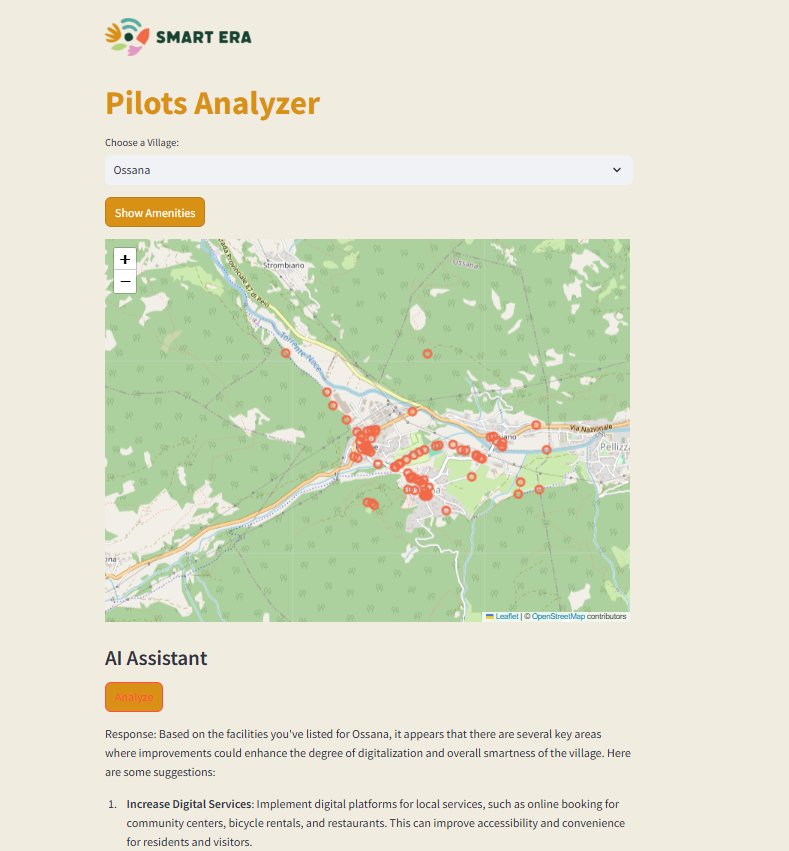

# Pilots Analyzer

Pilots Analyzer is an interactive web application for exploring and analyzing amenities in various villages using geospatial data and AI insights. It leverages Overpass API for fetching geographic data and integrates AI to provide suggestions for rural development, digitalization, and smart village improvements.

A live demo of this component can be found at: [https://smartera-analyzer-v2.streamlit.app/](https://smartera-analyzer-v2.streamlit.app/)



## Features
- **Interactive Map**: Displays amenities in selected villages with markers.
- **Village Selection**: Choose from a list of predefined villages.
- **AI Analysis**: Get AI-driven suggestions based on available amenities.
- **PDF Export**: Download AI analysis in a PDF format.
- **Streamlit UI**: User-friendly interface with customizable styles.

## Installation

1. Clone the repository:
   ```bash
   git clone https://github.com/your-username/pilots-analyzer.git
   cd pilots-analyzer
   ```

2. Install dependencies:
   ```bash
   pip install -r requirements.txt
   ```

3. Run the application:
   ```bash
   streamlit run app.py
   ```

## Dependencies

- `requests`: For API requests.
- `streamlit`: Framework for building the interactive UI.
- `folium`: For creating interactive maps.
- `streamlit-folium`: For rendering Folium maps in Streamlit.
- `fpdf`: For generating PDFs.
- `json`: For handling JSON data.

Install these dependencies with:
```bash
pip install requests streamlit folium streamlit-folium fpdf
```

## Usage

1. Launch the app:
   ```bash
   streamlit run app.py
   ```

2. **Select a Village**: Use the dropdown menu to choose a village.

3. **Show Amenities**: Click the "Show Amenities" button to fetch and display amenities on the map.

4. **AI Analysis**:
   - Click "Analyze" to get AI-driven suggestions.
   - Download the analysis as a PDF using the provided button.

## Configuration

- **Overpass API**: The app uses the Overpass API to fetch amenities. Customize the query or endpoint as needed.
- **AI Analysis**: Ensure the correct `CHATBOT_ID` and `Authorization` token are set for AI integration.

## Styling

The app is styled with:
- **Primary Color**: Dark Green (`#164031`)
- **Secondary Color**: Golden Yellow (`#d99115`)
- **Accent Color**: Orange (`#f16948`)
- **Background Color**: Light Beige (`#f0ecdf`)

Modify the styles in the `st.markdown` section if desired.

## Example Villages

The application includes a list of predefined villages such as:
- Ossana
- Male
- Vermiglio
- Sóller
- Padna
- Karpachevo

Add or remove villages in the `villages` list.

## Troubleshooting

- **API Errors**: Check if Overpass API or AI API endpoints are reachable.
- **Missing Amenities**: Ensure the selected village has valid data.
- **Map Display Issues**: Verify Folium and `streamlit-folium` versions.

## License

This project is licensed under the MIT License. 
